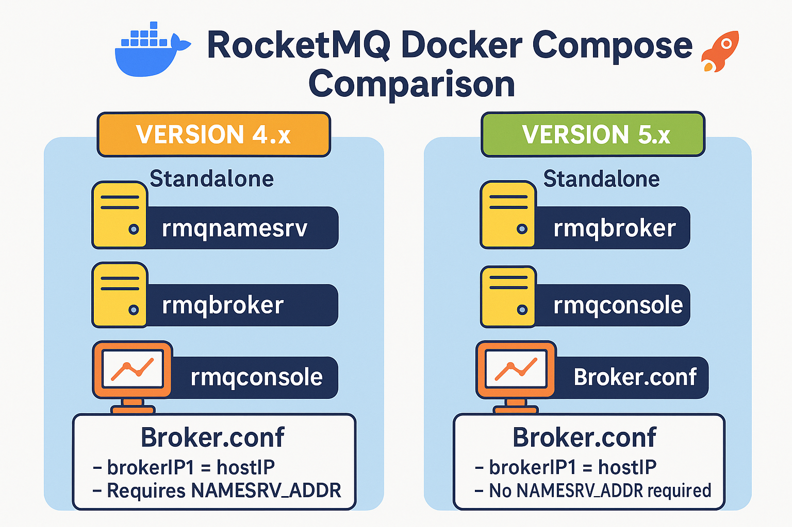

<p align="center">
    <a href="" target="_blank">
      
    </a>
</p>
<h1 align="center">rocketmq-docker-compose</h1>
<p align="center"><strong>rocketmq-docker-compose 单机部署<br><em>持续更新中～</em></strong></p>
<div align="center">
    <a href="https://github.com/AlfonsoKevin/rocketmq-docker-compose"></a></div>


---

## 介绍

---

使用**docker-compose**在服务器中快速**部署rocketmq单机版本**，并且提供了两个版本4.9.4和5.1.4，都是非常稳定的~

> 先决条件
>
> docker安装
>
> docker-compose安装

### 🚀快速开始

- 下载项目
- 选择**v4.9**或者是**v5.1**中的一个,以`rocketmq-compose-master-v4.9`为例
- 进入到`./conf/broker.conf`中进行配置，将修改**broker.conf**中的`brokerIP1`参数，修改为**本机IP**
- 进入到文件夹中，使用命令完成构建

构建

```bash
docker-compose -f docker-compose-rocketmq4.9.yml up -d
```

移除

```bash
docker-compose -f docker-compose-rocketmq4.9.yml down
```

- 最后访问 `IP : 8086` 查看控制台

### 注意事项

- 欢迎提出建议，您可以通过提出 Issue 的方式参与到项目中来。

---

感谢您对该项目的关注和支持！🕵️‍♀️
